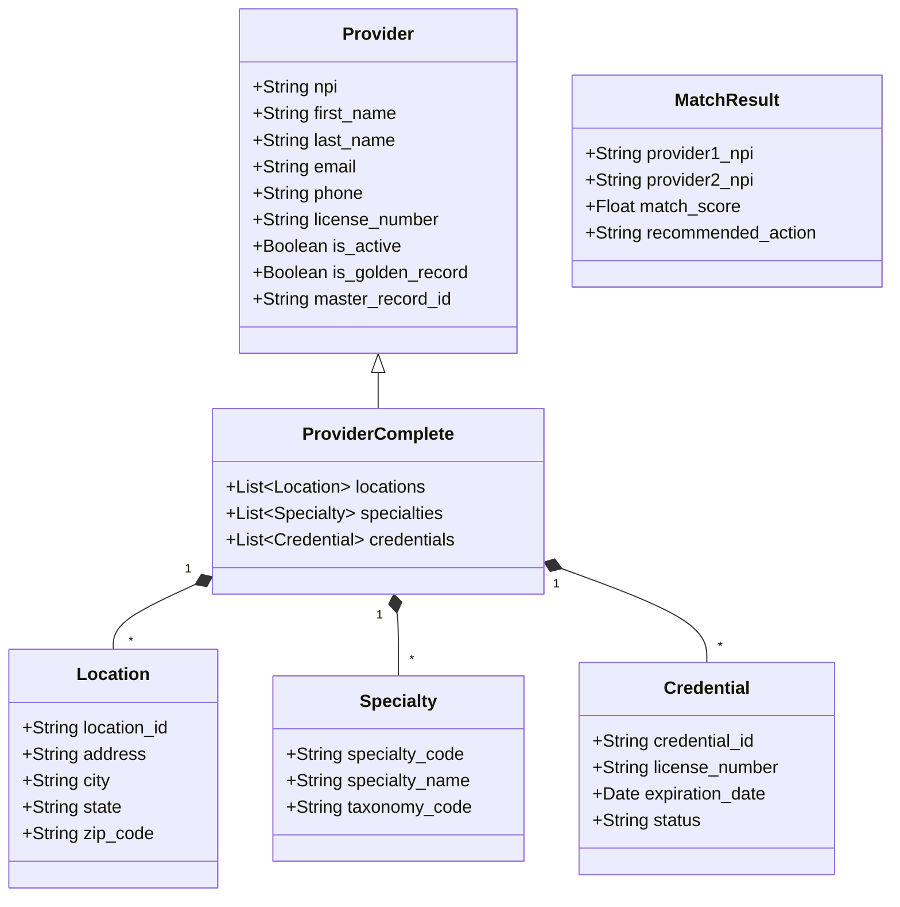
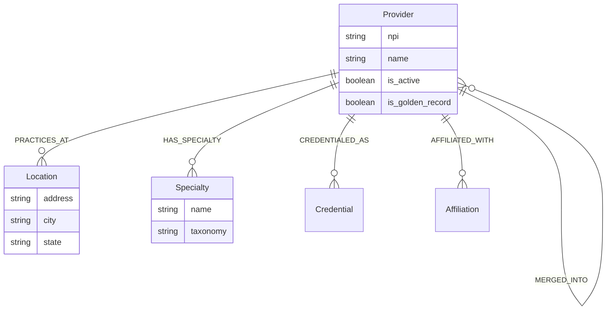
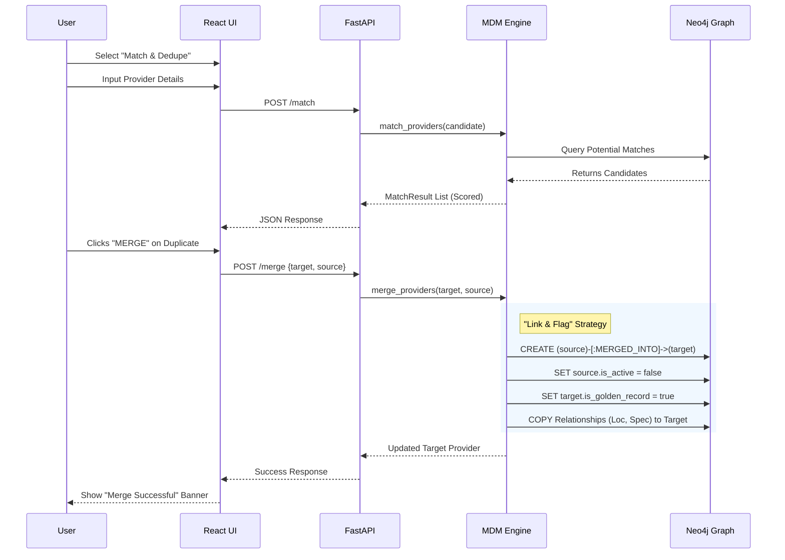

# Software Engineering Artifacts

## System Architecture & workflows

The following UML diagrams document the structure, data models, and core workflows of the Provider MDM Graph application.

### 1. Class Diagram (Backend Data Models)
This diagram illustrates the Pydantic models defined in `app/models.py` which enforce the schema for API communication and internal logic.

### 2. Graph Data Model (Neo4j Schema)
This entity-relationship diagram shows how data is stored in the Neo4j graph database, highlighting the relationships between entities and the lineage tracking.

### 3. Sequence Diagram (Merge Workflow)
This diagram details the flow of interactions when a user identifies and merges a duplicate provider record into a Golden Record.

